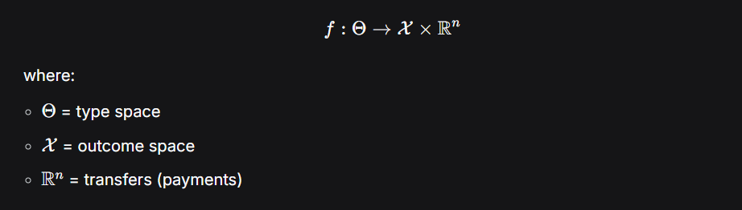
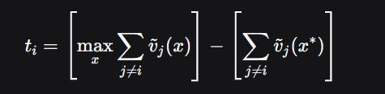
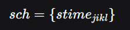
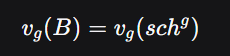

# Detailed Study Notes: Lecture 5.2 – Decentralized Scheduling & Mechanism Design

## 1. **Introduction to Decentralized Scheduling**
- **Decentralized Cloud**: Cloud resources are owned by multiple providers, and scheduling decisions are distributed among them.
- **Problem**: How to coordinate resource allocation across multiple providers and consumers without central control.
- **Key players**: Providers (own resources), Consumers (request resources), Brokers (mediate between them).

## 2. **Interdependency**
- **Definition**: Two or more entities depend on each other to achieve a goal.
- **Example**: Entity A needs resources from Entity B to complete a task.
- **Solution**: **Coordination** – structured communication and decision-making to resolve interdependencies.

## 3. **Coordination & Mechanism Design**
- **Mechanism Design**: Designing rules and incentives so that self-interested agents behave in a way that achieves a global goal.
- **Components of a mechanism**:
  - **Rules**: How agents interact.
  - **Communication structures**: How information is shared.
  - **Decision protocols**: How outcomes are determined.

## 4. **Incentive Compatibility (IC)**
- **Rational agents**: Act to maximize their own utility.
- **Incentive Compatible Mechanism**: Agents are incentivized to truthfully reveal their private information.
- **Why it matters**: Prevents lying, ensures fairness, and aligns individual goals with system goals.

## 5. **Social Choice Function (SCF)**
- **Goal**: Map agents’ true types (private info) to the socially optimal outcome.
- **Formally**:  

## 6. **VCG (Vickrey-Clarke-Groves) Mechanism**
- **Purpose**: Ensures truth-telling and social efficiency.
- **Two Rules**:
  1. **Allocation Rule**: Choose outcome that maximizes total reported welfare.

  2. **Payment Rule (Clarke Pivot Rule)**:

- **Result**: **Dominant Strategy Incentive Compatible (DSIC)** – truth-telling is always optimal.

## 7. **Mapping Cloud Scheduling to Mechanism Design**
| **Mechanism Design Element** | **Cloud Scheduling Equivalent** |
|-----------------------------|-------------------------------|
| Agent ($i$)                 | Cloud tenant / task           |
| Type ($\theta_i$)           | Task requirements (CPU, memory, deadline) |
| Outcome ($x$)               | Resource allocation (server, time slot)   |
| SCF ($f$)                   | Scheduling goal (max utilization, min makespan) |
| Mechanism ($g$)             | Scheduling algorithm + pricing model      |
| Transfer ($t_i$)            | Price charged to tenant                  |
| IC                          | Prevents misreporting of requirements    |
| IR (Individual Rationality) | Ensures QoS / participation              |
| Efficiency                  | Maximizes system welfare                 |

## 8. **Preferences & Utility in Cloud Scheduling**
- **Valuation (\(v_i\))**: Non-monetary value of QoS (e.g., low latency, high reliability).
- **Utility function**:

- **Strategic behavior**: Tenants may lie about needs to get better service or lower price.
- **Designer’s goal**: Ensure u_i{Truth} > u_i{Lie}

## 9. **Economic Model & Combinatorial Auctions**
- **Schedule representation**:  

- **Partial schedule**: Feasible allocation for one agent.
- **Combinatorial Auction (CAP)**:
  - Bidders bid on **bundles** of items (resource-time units).
  - **Valuation function**:  

  - **Winner determination**: Maximize total valuation.

## 10. **Bidding in Combinatorial Auctions**
- **Bid**: Expression of preferences for resource bundles.
- **Bidding languages**:  
  - **OR-of-XORs**, **XOR-of-ORs**, etc.
  - Trade-off between **expressiveness** and **simplicity**.

## 11. **Key Terms Recap**
- **Interdependency**: Mutual reliance between entities.
- **Coordination**: Structured interaction to resolve interdependencies.
- **Mechanism Design**: Rule-based system to align individual and social goals.
- **Incentive Compatibility**: Truth-telling is optimal.
- **VCG**: Efficient, truthful mechanism.
- **Combinatorial Auction**: Auction where bidders bid on bundles.

---

# Multiple Choice Questions (MCQs)

**1. What is the primary goal of mechanism design in decentralized scheduling?**
- A) Maximize provider profit
- B) Ensure truth-telling and achieve global efficiency
- C) Minimize communication overhead
- D) Reduce computational complexity

B) Ensure truth-telling and achieve global efficiency
Explanation: Mechanism design aims to align self-interested behavior with social welfare through rules and incentives.

**2. In the VCG mechanism, the payment rule charges each agent based on:**
- A) Their reported valuation
- B) The harm they cause to others
- C) A fixed price per resource
- D) The highest bid in the auction

B) The harm they cause to others
Explanation: The Clarke Pivot Rule charges each agent the negative externality their participation imposes on others.

**3. Which of the following best describes “interdependency” in decentralized systems?**
- A) Two providers using the same hardware
- B) Entities needing shared resources to achieve goals
- C) Consumers competing for the same resource
- D) Brokers mediating between providers

B) Entities needing shared resources to achieve goals
Explanation: Interdependency arises when entities cannot achieve their goals without resources or cooperation from others.

**4. In cloud scheduling, what does the “type” θᵢ of an agent represent?**
- A) The price they are willing to pay
- B) Their private task requirements
- C) Their identity in the system
- D) The resource they own

B) Their private task requirements
Explanation: The type θᵢ represents private information like CPU needs, memory, deadline, and valuation.

**5. What does “Incentive Compatibility (IC)” ensure?**
- A) Agents always participate
- B) Agents reveal their true private information
- C) Agents are charged fairly
- D) Resources are allocated randomly

B) Agents reveal their true private information
Explanation: IC ensures truth-telling is the optimal strategy for each agent.

**6. In a combinatorial auction, what is a “bundle”?**
- A) A single resource unit
- B) A set of items bid on together
- C) The total number of bidders
- D) The auctioneer’s inventory

B) A set of items bid on together
Explanation: In combinatorial auctions, bidders can bid on combinations of items (bundles).

**7. The Clarke Pivot Rule in VCG charges an agent:**
- A) The highest bid
- B) The difference between the best possible welfare without them and the actual welfare of others
- C) A fixed percentage of their valuation
- D) The average bid of all agents

B) The difference between the best possible welfare without them and the actual welfare of others
Explanation: This is the formal definition of the Clarke Pivot Rule: tᵢ = max Σ vⱼ (without i) – Σ vⱼ (with i).

**8. Which bidding language is known for balancing expressiveness and simplicity?**
- A) XOR-of-ORs
- B) Plain text
- C) Binary only
- D) First-price sealed bid

A) XOR-of-ORs
Explanation: XOR-of-ORs is a common bidding language that balances expressiveness (can model complex preferences) and simplicity (relatively easy to process).

---

# Short Answer Questions

1. **Explain the difference between “coordination” and “mechanism design” in decentralized systems.**

Coordination refers to the general process of managing interdependencies between entities through communication and decision-making structures. It is a broad concept that includes any method (e.g., protocols, agreements, workflows) that enables multiple parties to work together toward a common or compatible goal.

Mechanism Design is a specific, formal approach to coordination rooted in game theory and economics. It involves designing the rules of the game—including incentives, payment schemes, and allocation procedures—so that rational, self-interested agents will voluntarily behave in a way that achieves a desired global outcome (like efficiency or fairness). In essence, mechanism design is the engineering of coordination using economic principles.

Key Difference:

Coordination = What needs to happen (entities need to work together).

Mechanism Design = How to make it happen (by designing incentives so they want to work together truthfully and efficiently).

2. **Why is truth-telling important in cloud scheduling mechanisms? Give an example of what could go wrong if agents lie.**

Importance of Truth-Telling:
In cloud scheduling, the scheduler (provider or broker) relies on information from tenants (e.g., resource needs, deadlines, valuations) to make efficient allocation decisions. If agents lie, the scheduler makes decisions based on false data, leading to:

Inefficient allocations (wrong resource to wrong task)

System instability (over- or under-provisioning)

Unfair outcomes (some agents gaming the system)

Reduced social welfare and provider revenue

Example of a Lie and Its Consequence:
A tenant runs a financial trading task with a true need for 10 CPU cores and a 1ms deadline (high valuation). If they lie and report needing only 2 cores with a 100ms deadline (low valuation) to get a cheaper "low-priority" spot, the scheduler might place it on a low-power server.

What goes wrong:

The task misses its deadline because it’s under-resourced.

The high-value transaction fails, causing financial loss.

The resource given to this task is wasted (inefficient use).

Meanwhile, a truly low-priority task (like a backup) might be waiting unnecessarily.

The provider’s reputation and revenue suffer due to poor QoS.

3. **Describe the two main components of the VCG mechanism and how they promote efficiency and truthfulness.**

A. The Allocation Rule (Efficiency Rule)

Rule: Choose the outcome 
x
∗
x 
∗
  that maximizes the sum of reported valuations:

x
∗
=
arg
⁡
max
⁡
x
∈
X
∑
i
=
1
n
v
~
i
(
x
)
x 
∗
 =arg 
x∈X
max
​
  
i=1
∑
n
​
  
v
~
  
i
​
 (x)
Promotes Efficiency: This ensures the chosen outcome maximizes total social welfare—the "pie" is as large as possible.

B. The Payment Rule (Clarke Pivot Rule – Incentive Compatibility)

Rule: Charge each agent 
i
i the harm they cause to others:

t
i
=
[
max
⁡
x
∑
j
≠
i
v
~
j
(
x
)
]
−
[
∑
j
≠
i
v
~
j
(
x
∗
)
]
t 
i
​
 = 
​
  
x
max
​
  
j

=i
∑
​
  
v
~
  
j
​
 (x) 
​
 − 
​
  
j

=i
∑
​
  
v
~
  
j
​
 (x 
∗
 ) 
​
 
Promotes Truthfulness:

The first term is the best possible welfare for others if agent i were absent.

The second term is the actual welfare of others with agent i present.

The difference is the externality agent i imposes.

Key Insight: An agent’s payment does not depend directly on their own report, but on how their presence changes outcomes for others. This removes the incentive to lie—misreporting cannot lower your payment in a way that increases your net utility.

Why VCG is Dominant Strategy Incentive Compatible (DSIC):
Truth-telling is optimal regardless of what others do. Even if others lie, your best strategy is to tell the truth.

4. **What is the role of “individual rationality” in mechanism design, and why is it important for cloud providers?**

Individual Rationality (IR) – Definition:
Also called the participation constraint, IR ensures that an agent’s utility from participating in the mechanism is at least as high as their utility from not participating (their outside option, often normalized to zero).

Formally:
For every agent 
i
i and every true type 
θ
i
θ 
i
​
 ,

u
i
(
outcome
∣
θ
i
)
≥
0
u 
i
​
 (outcome∣θ 
i
​
 )≥0
In cloud terms: Value of service received ≥ Price paid.

Why it’s Important for Cloud Providers:

Attracts and Retains Tenants: If tenants consistently lose utility (get poor service for high cost), they will leave.

Ensures Market Viability: A mechanism that violates IR is unsustainable—no one will use it.

Builds Trust: Tenants trust that the system won’t exploit them.

Aligns with Business Goals: Happy tenants mean recurring revenue and positive reputation.

Example in Cloud Scheduling:
A tenant with a true valuation of $100 for a VM instance should not be charged $150. If they are, their utility is negative (
100
−
150
=
−
50
100−150=−50), they won’t participate, and the provider loses business.

5. **How does a combinatorial auction differ from a traditional single-item auction in the context of cloud scheduling?**

Aspect	Traditional Single-Item Auction	Combinatorial Auction (CAP)
Items Auctioned	One item (e.g., one server for 1 hour)	Multiple items bundled together (e.g., {Server A 1–2pm, Server B 2–3pm, FPGA slot})
Bidding	Bid on single item	Bid on bundles of items
Preferences Expressed	Simple: “I want this item at price P”	Complex: “I want bundle B1 or bundle B2, but not both” (using XOR, OR languages)
Winner Determination	Simple: Highest bid wins	NP-hard optimization: Find allocation maximizing total value without assigning same item twice
Suitability for Cloud	Poor—cloud tasks need multiple resources across time	Excellent—can capture complex task requirements (e.g., “need CPU + GPU + storage simultaneously”)
| **Aspect**                | **Traditional Single-Item Auction**                        | **Combinatorial Auction (CAP)**                                                                 |
|--------------------------|------------------------------------------------------------|-----------------------------------------------------------------------------------------------|
| Items Auctioned          | One item (e.g., one server for 1 hour)                     | Multiple items bundled together (e.g., {Server A 1–2pm, Server B 2–3pm, FPGA slot})           |
| Bidding                  | Bid on single item                                         | Bid on bundles of items                                                                       |
| Preferences Expressed    | Simple: “I want this item at price P”                      | Complex: “I want bundle B1 or bundle B2, but not both” (using XOR, OR languages)              |
| Winner Determination     | Simple: Highest bid wins                                   | NP-hard optimization: Find allocation maximizing total value without assigning same item twice |
| Suitability for Cloud    | Poor—cloud tasks need multiple resources across time        | Excellent—can capture complex task requirements (e.g., “need CPU + GPU + storage simultaneously”) |

Why CAP is Better for Cloud Scheduling:

Expresses Complementarities: A task may need CPU and memory and GPU together—valuing the bundle more than the sum of parts.

Expresses Substitutability: A task may accept either Server A or Server B.

Efficiency: Can allocate complex workflows in one auction round rather than piecemeal.

---

# Case Study Questions

**Case Study 1: Multi-Provider Cloud Scheduling**

A cloud brokerage service must schedule tasks across three providers (A, B, C). Each task has private requirements (CPU, memory, deadline). Providers are self-interested and may misreport availability or capacity to maximize profit.

- **Task**: Design a mechanism that ensures:
  - Providers truthfully report capacity
  - Tasks are scheduled efficiently (minimize makespan)
  - Both providers and consumers participate willingly

**Questions:**
1. Which mechanism design principles would you apply here?
2. How would you adapt the VCG mechanism for this multi-provider setting?
3. What bidding language would you recommend for consumers to express their preferences, and why?

**Case Study 2: FPGA Resource Allocation**

A cloud provider offers FPGA resources (measured in CLBs) to tenants running machine learning tasks. Tenants have private deadlines and valuation for low-latency processing. Some may underreport needs to get cheaper access.

- **Task**: Propose a pricing and allocation model that:
  - Prevents underreporting
  - Maximizes total system welfare
  - Ensures high-value tasks get priority

**Questions:**
1. How would you model the tenant’s valuation function?
2. How would you ensure incentive compatibility?
3. How could a combinatorial auction be used to allocate FPGA time slots efficiently?